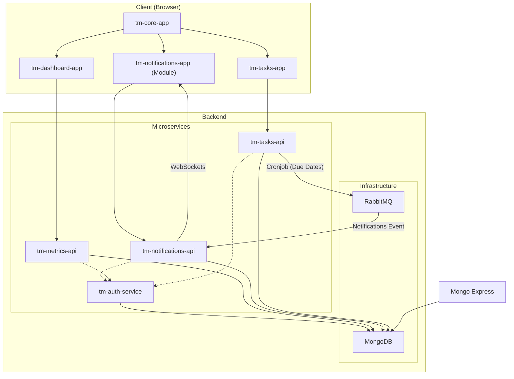

# Task Manager Application

## Overview

This repository contains a full-stack Task Manager application built with Angular, NestJS, and a microservices architecture. It leverages Nx for monorepo management and Docker Compose for streamlined development and deployment.

## Getting Started

### Prerequisites

- Docker
- Docker Compose
- Node.js (LTS recommended)
- npm or yarn

### Installation

1. **Clone the repository:**
   ```bash
   $ git clone https://github.com/your-username/task-manager.git
   $ cd task-manager
   ```
1. Use the expected node version
    ```bash
    $ nvm install
    ```
2. Install dependencies:

    ```bash
    $ npm install
    ```
3. Build the apps
    ```bash
    $ npm run build:all
    ```
4. Start the application using Docker Compose:

    ```
    $ docker-compose up -d
    ````

This will build and start all services defined in docker-compose.yml.

### Accessing the Application
- Task Manager UI (tm-core-app): http://localhost:4200
- RabbitMQ Management UI: http://localhost:15672 (default credentials: guest/guest)
- Mongo Express: http://localhost:8081 (credentials: root/example)

### Development
#### Running a Specific App
Use the following command to run a specific application in development mode:
```bash
$ nx serve <app-name> 
```
For example:
```bash
$ nx serve tm-core-app
```

#### Creating a New Microservice
Generate the service using Nx:
```
$ nx generate @nx/nest:application <service-name> --frontendProject=<frontend-app-name> 
```

Replace `<service-name>` and `<frontend-app-name>` with your desired names.

Define the service in `docker-compose.yml`, specifying the build context, ports, and dependencies.

Implement your API logic within the generated service directory.

#### Connecting to the Database
The MongoDB connection details are available as environment variables within Docker containers:
```YML
MONGO_INITDB_ROOT_USERNAME: root
MONGO_INITDB_ROOT_PASSWORD: example
MONGO_INITDB_DATABASE: taskmanagerdb
```
### Using the Message Queue
The RabbitMQ connection details are also available as environment variables:
```YML
Hostname: rabbitmq
Port: 5672
```

## Architecture

The application is structured as an Nx workspace, with code organized into apps and libs:

- **Apps:** Represent independently deployable units (microservices, microfrontends).
- **Libs:** Contain shared code (components, utilities, services) consumed by apps.

**Key Components:**

- **Microfrontends:**
    - `tm-core-app`: The main user interface for interacting with the Task Manager.
    - `tm-dashboard-app`: (Potentially) A separate dashboard for analytics or admin tasks.
    - `tm-notifications-app`: (Potentially) A dedicated UI for managing notifications.
    - `tm-tasks-app`: (Potentially) A focused interface for task-related actions.
- **Microservices:**
    - `tm-auth-service`: Handles user authentication and authorization.
    - `tm-metrics-api`: Provides API endpoints for application metrics.
    - `tm-notifications-api`: Manages notifications related to tasks.
    - `tm-tasks-api`: Exposes API endpoints for managing tasks.
- **Infrastructure:**
    - `rabbitmq`: Message queue for asynchronous communication between microservices.
    - `mongodb`: Primary database for storing application data.
    - `mongo-express`: Web-based UI for managing the MongoDB database.


### Architecture Diagram



# Notes
1. The `package.json` files inside each individual project are meant for Docker to know what to install per app. Do not install them locally.
2. `Docker` is meant for built environments. Do not expect them to reflect your changes if you have not re-compiled.
3. For development, you can adjust the dev compose file so that it only includes services or apps you won't change. You are expected to develop in your machine in watch mode and then point the URLs to the docker services. Typically, services would use the Docker host aliases instead of IPs. Change this to IPs when working on the service of interest.