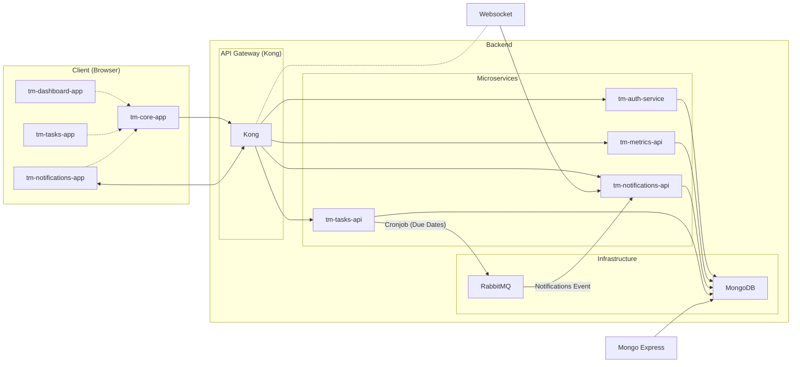

# Task Manager Application

## Overview

This repository contains a full-stack Task Manager application built with Angular, NestJS, and a microservices architecture. It leverages Nx for monorepo management and Docker Compose for streamlined development and deployment. Kong API Gateway manages and secures access to the microservices, including real-time communication via WebSockets.

## Getting Started

### Prerequisites

- Docker
- Docker Compose
- Node.js (LTS recommended)
- npm or yarn

### Installation

1. **Clone the repository:**
   ```bash
   $ git clone https://github.com/your-username/task-manager.git
   $ cd task-manager
   ```
1. Use the expected node version
   ```bash
   $ nvm install
   ```
1. Install dependencies:

   ```bash
   $ npm install
   ```

1. Build the apps
   ```bash
   $ npm run build:all
   ```
1. Start the application using Docker Compose:

   ```
   $ docker-compose up -d
   ```

This will build and start all services defined in docker-compose.yml.

### Accessing the Application

- Task Manager UI (tm-core-app): http://localhost:4200
- RabbitMQ Management UI: http://localhost:15672 (default credentials: guest/guest)
- Mongo Express: http://localhost:8081 (credentials: root/example)
- Kong API Gateway: http://localhost:8000 (For Admin API - see Kong documentation for details)

### Development

#### Running a Specific App

Use the following command to run a specific application in development mode:

```bash
$ nx serve <app-name>
```

For example:

```bash
$ nx serve tm-core-app
```

#### Creating a New Microservice

Generate the service using Nx:

```
$ nx generate @nx/nest:application <service-name> --frontendProject=<frontend-app-name>
```

Replace `<service-name>` and `<frontend-app-name>` with your desired names.

Define the service in `docker-compose.yml`, specifying the build context, ports, and dependencies.

Implement your API logic within the generated service directory.

#### Connecting to the Database

The MongoDB connection details are available as environment variables within Docker containers:

```YML
MONGO_INITDB_ROOT_USERNAME: root
MONGO_INITDB_ROOT_PASSWORD: example
MONGO_INITDB_DATABASE: taskmanagerdb
```

### Using the Message Queue

The RabbitMQ connection details are also available as environment variables:

```YML
Hostname: rabbitmq
Port: 5672
```

## Architecture

The application is structured as an Nx workspace, with code organized into apps and libs:

- **Apps:** Represent independently deployable units (microservices, microfrontends).
- **Libs:** Contain shared code (components, utilities, services) consumed by apps.

**Key Components:**

- **Microfrontends:**
  - `tm-core-app`: The main user interface for interacting with the Task Manager. This application connects to Kong for real-time notifications.
  - `tm-dashboard-app`: (Potentially) A separate dashboard for analytics or admin tasks.
  - `tm-notifications-app`: (Potentially) A dedicated UI for managing notifications.
  - `tm-tasks-app`: (Potentially) A focused interface for task-related actions.
- **Microservices:**
  - `tm-auth-service`: Handles user authentication and authorization.
  - `tm-metrics-api`: Provides API endpoints for application metrics.
  - `tm-notifications-api`: Manages notifications related to tasks. Kong exposes a WebSocket endpoint for real-time updates from this service.
  - `tm-tasks-api`: Exposes API endpoints for managing tasks.
- **Infrastructure:**
  - `rabbitmq`: Message queue for asynchronous communication between microservices.
  - `mongodb`: Primary database for storing application data.
  - `mongo-express`: Web-based UI for managing the MongoDB database.
  - `kong`: API Gateway for routing traffic, including WebSocket connections, to the microservices.

### Architecture Diagram



# Notes

1. The `package.json` files inside each individual project are meant for Docker to know what to install per app. Do not install them locally.
2. `Docker` is meant for built environments. Do not expect them to reflect your changes if you have not re-compiled.
3. For development, you can adjust the dev compose file so that it only includes services or apps you won't change. You are expected to develop in your machine in watch mode and then point the URLs to the docker services. Typically, services would use the Docker host aliases instead of IPs. Change this to IPs when working on the service of interest.

## Troubleshooting

- Nx Daemon can fail time to time. You can run `nx reset` if that does not work you may also run `nx daemon --stop` and `nx daemon --start`. `nx repair` can come handy as well.

## Kubernetes Deployment

This application can be deployed to a Kubernetes cluster using the provided Kubernetes YAML configurations.

### Prerequisites

- A running Kubernetes cluster (local minikube or a cloud provider cluster).
- Kubectl configured to interact with your cluster.

### Deployment Steps

1. **Build Docker Images:**

   - Ensure you have built the Docker images for all your services and pushed them to a registry accessible by your Kubernetes cluster. You can use a local registry or a cloud-based registry like Docker Hub.
   - Update the `image` fields in the deployment YAML files to point to your Docker image URLs.

2. **Apply Kubernetes Configurations:**

   - Apply the Kubernetes configurations from the `compose.k8s.yaml` file:
     ```bash
     kubectl apply -f compose.k8s.yaml
     ```

3. **Access the Application:**
   - **Kong API Gateway:**
     - The Kong service is exposed using a LoadBalancer. Get the external IP address:
       ```bash
       kubectl get service kong
       ```
     - Access the Kong Admin API using the external IP and port 8001 (e.g., `http://<EXTERNAL-IP>:8001`).
   - **Task Manager UI (tm-core-app):**
     - The `tm-core-app` service is also exposed using a LoadBalancer. Get the external IP address:
       ```bash
       kubectl get service tm-core-app
       ```
     - Access the Task Manager UI using the external IP and port 4200 (e.g., `http://<EXTERNAL-IP>:4200`).
   - **Other Services:**
     - The other services (microservices, MongoDB, RabbitMQ) are not exposed externally by default. You can access them within the cluster or expose them using Services of type LoadBalancer or NodePort if needed.

### Configuration

- **ConfigMaps:** The deployment uses ConfigMaps to manage environment variables and configurations for the services. You can customize these ConfigMaps in the `compose.k8s.yaml` file.
- **PersistentVolumes:** PersistentVolumeClaims are defined for MongoDB and RabbitMQ to ensure data persistence. You might need to adjust the storage classes or provision PersistentVolumes based on your Kubernetes cluster configuration.
- **NetworkPolicy:** A basic NetworkPolicy is included to allow communication between the services. You can customize this policy for more restrictive network access control.

### Scaling

  You can easily scale the deployments using kubectl:
  
  ```bash
  kubectl scale deployment <deployment-name> --replicas=<desired-replica-count>
  ```
  For example, to scale the tm-tasks-api to 3 replicas:
  ```bash
  kubectl scale deployment tm-tasks-api --replicas=3
  ````
